# GitHub

GitHubは、ソフトウェア開発プロジェクトのためのソースコード管理サービスです。
コードをオンライン上にアップロードすることで、保存したり、他の人と共同で作業したりすることができます。
Gitに関する説明はこちらをご覧ください。
[Gitについて]()

1. GitHubの登録
2. レポジトリの作成

## 1. GitHubの登録

まずは以下のリンクからGitHubの登録を行ないましょう。
https://github.com/

Passwordを忘れないよう必ずどこかにメモしておきましょう。

## 2. レポジトリの作成

登録後、ログインすると、以下のようなページになります。
右上の四角いアイコンをクリックするとメニューが開かれるので、「Your profile」をクリックしましょう。

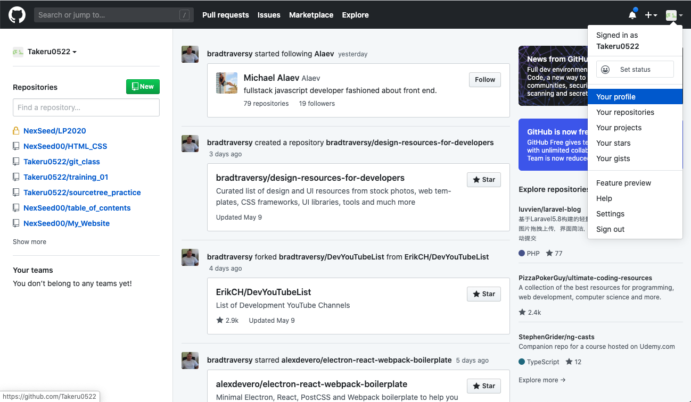

このページはブックマークしておきましょう。
右上の「＋」のアイコンをクリックするとメニューが開くので、「New repository」をクリックします。

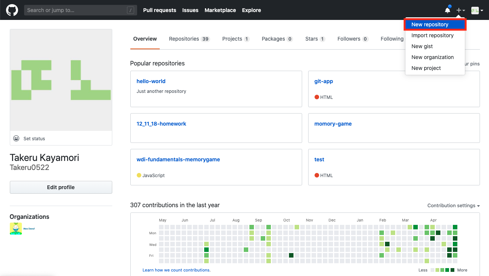

レポジトリの名前を入力し、publicにチェックが入っていることを確認して、「Create repository」をクリックします。

レポジトリ名については以下のルールを守ってください。

1. 日本語ではなく、英語、アルファベットで入力
2. 何のレポジトリなのかわかる名前にする。
3. スペースを開けない。文字を繋げる場合は「_」または「-」で繋げる。（例. js_todo_listなど）

※３つ目の項目の「Initialize this repository with a README」には、チェックを入れないようにしてください。

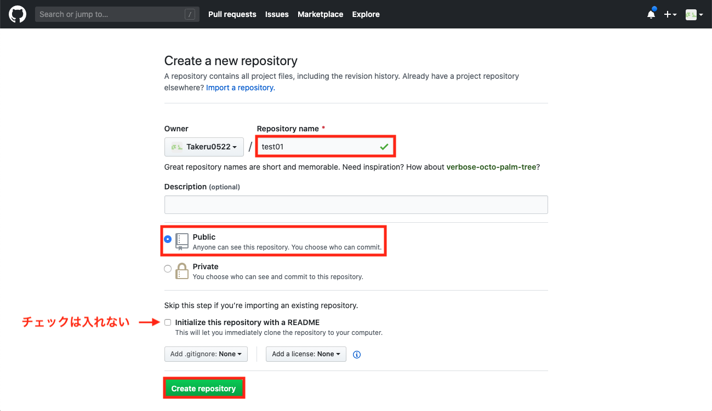

Create repositoryを開くと、作成したレポジトリのページが開きます。これで、GitHub上（リモート）にレポジトリを作成することができました。

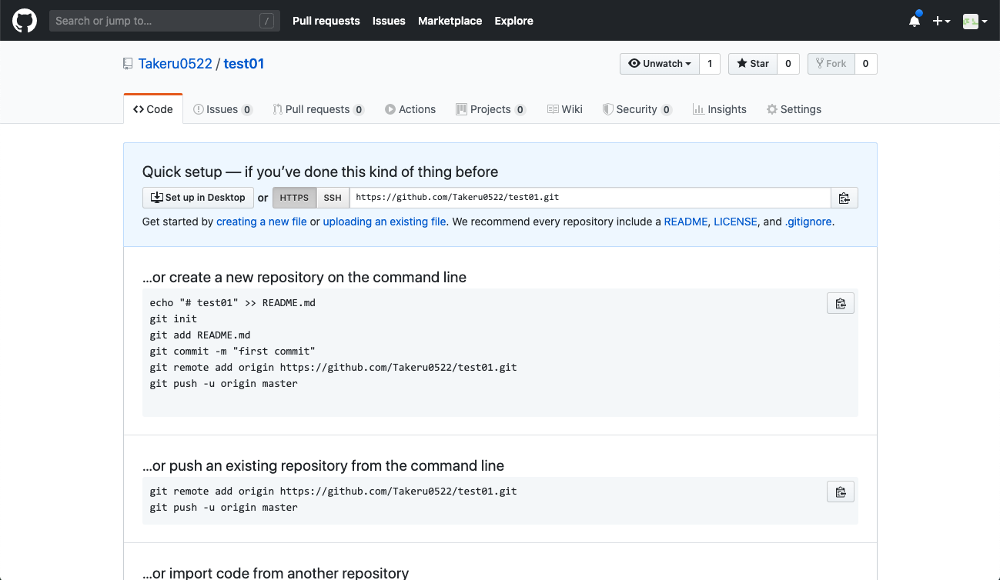

## 3. ローカルにGitレポジトリを作成する

GitHubにアップロードしたいレポジトリ（フォルダ）をVS Codeで開きます。
画面上のバーにある「Terminal → New Terminal」をクリックしてください。

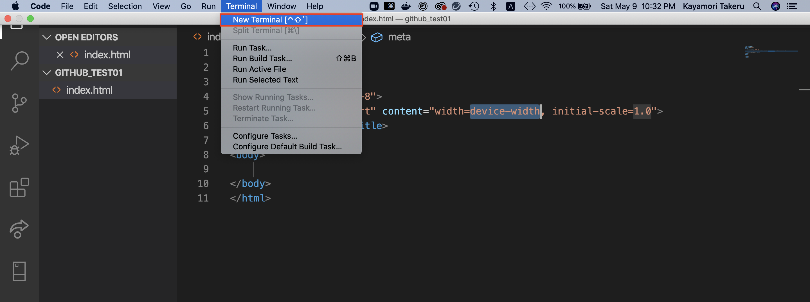

すると画面下部にターミナルが開きます。

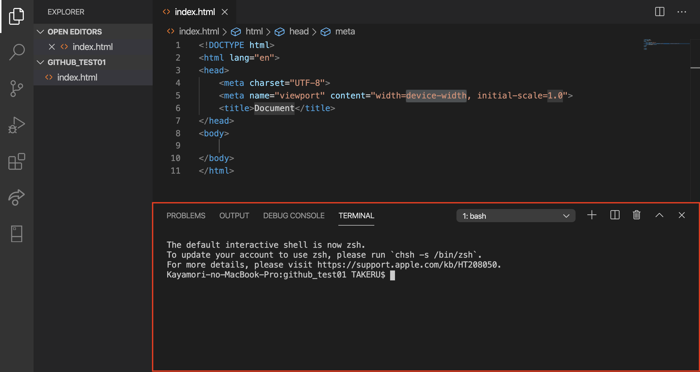

次の３つのコードを入力します。
1. `git init`
2. `git add .`
3. `git commit -m "任意のコメント"`
 

1.  `git init`

initとはinitializeの略で、新しいGitレポジトリを作成するコマンドです。

2.  `git add .`

コミットするファイルをします。
`.`はレポジトリないの全てのファイルを意味します。
`git add index.html`と書くことで特定のファイルだけを指定することもできます。

3. `git commit -m "任意のコメント"`
addで指定したファイルをコミットします。
これによって初めてファイルがGitレポジトリに保存されます。

``

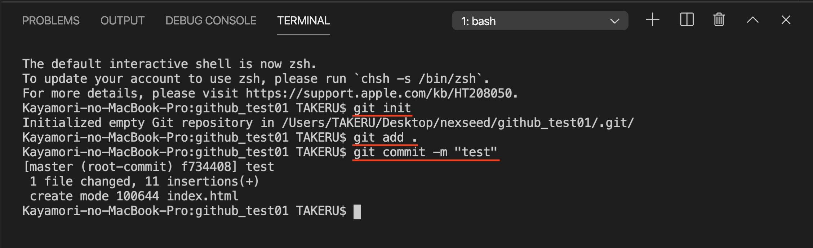

## 4. ローカルレポジトリとリモートレポジトリを紐付ける

次にローカルレポジトリとGitHub上のレポジトリを紐付けます。
GitHubに戻り、レポジトリのリンクをコピーします。
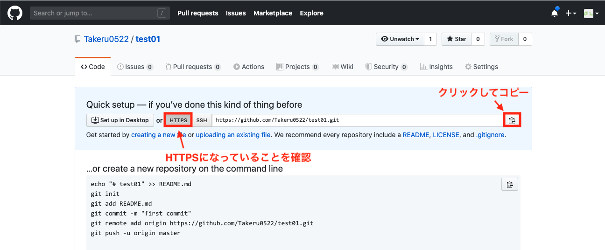

次に再びVS Codeに戻り以下のコマンドを入力します。
`git remote add origin コピーしたレポジトリのURL`

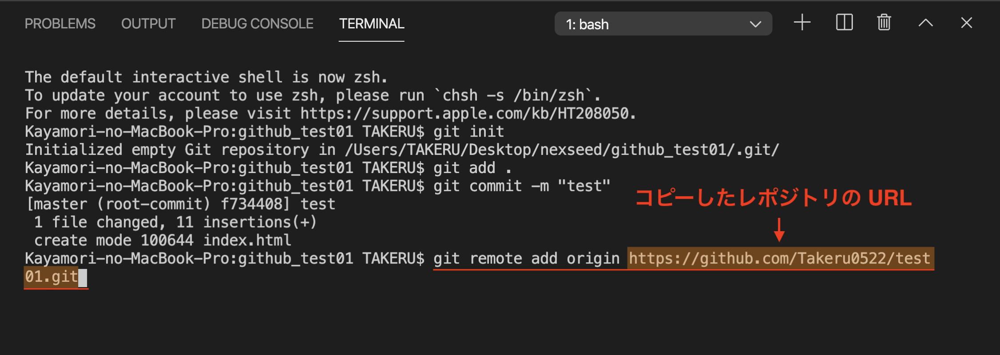

`git remote -v`でリモートレポジトリのURLを確認できます。

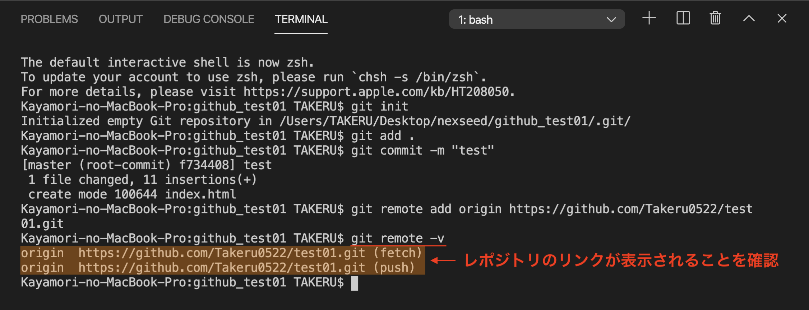

最後にローカルレポジトリをリモートにアップロードします。Gitではこのことを「プッシュ」と言います。
`git push origin master`のコマンドを入力します。

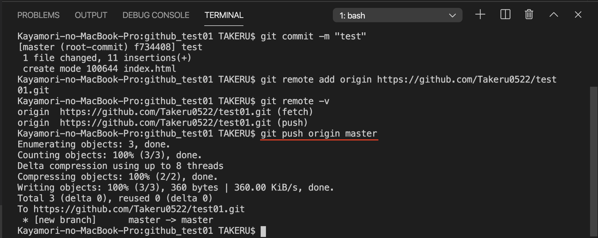

GitHubに戻り、ページをリロードしましょう。
以下の画像のようにプッシュしたファイルが表示されたら完了です。

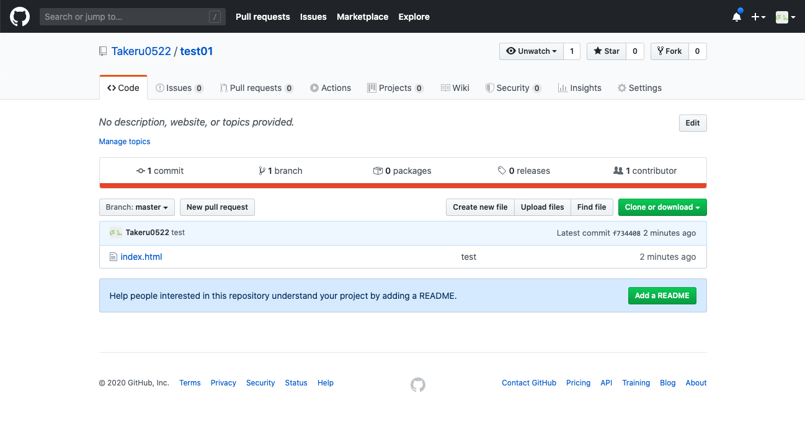

